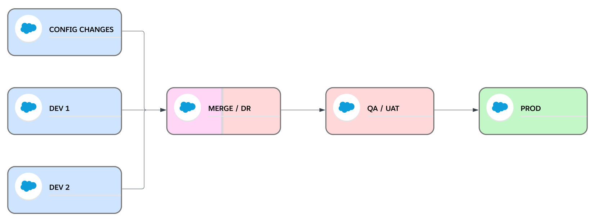

The Salesforce DevOps Strategy I'm proposing allows us to create devops pipelines from the very simple ones with a very straight path from implementation to production and a small implementation team working in the same sandbox to really complex settings in which we have several projects implementing changes at the same time with different deployment schedules that we can connect and and disconnect to the pipeline whenever we new projects appear or are finished.

## Examples of Pipelines We Can Build
With this Salesforce DevOps strategy we can build pipelines as **simple** as this one we can use in a company with a very small implementation team, maybe 1 or 2 admins or devs, that values quality processes that helps them avoid hectic deployments:

Or pipelines for **simple projects** where you have several developers or admins working in different implementation environments like this one:

Or we can go even bigger and configure a more **complex pipeline** for the situations where we have several projects going at the same time being implemented in different sets of implementation environments and Client Services or Business As Usual recurrent work and even possible hotfixes:
