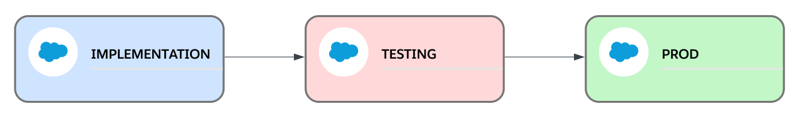

If you are evaluating tools to start implementing Salesforce DevOps, Travis-CI should be one of the tools you should look into.

We can use this [Travis-CI configuration](https://github.com/salesforce-devops-config/travis-ci){:target="_blank"} and GitHub to implement [pipelines](02-pipelines.html){:target="_blank"} using [this Salesforce DevOps Strategy](01-devops-strategy.html){:target="_blank"}.

## Preparing Your Repository with this Travis-CI Configuration
First you need to clone the [Travis-CI configuration repository](https://github.com/salesforce-devops-config/travis-ci){:target="_blank"} in a separate directory (not in your salesforce repository).

Then you need to copy the content of `config` directory of the Travis-CI repo inside the `config` directory of your repository, if you don't have a `config` directory in your repository, then just copy the whole `config` directory to the root of your directory (the root directory of your project is the directory that contains the sfdx-project.json file).

After that, if there's no `script` directory in your project, copy the whole `script` directory from the Travis-CI repo to the root of your repository, if you already have this `script` directory, copy the content of the `script` directory from the Travis-CI repository inside the `script` directory of your project.

Then copy the directories `rulesets` and `tests` and the files `.travis.yml`, `.pretierrc.yaml`, `package.json` and `sfdx-project.string-replacement.example.json` to the root of your project.

After doing this, go to your Travis-CI dashboard and find your salesforce's project repository, and in settings make sure to disable building for branches and pull requests, as we don't want Travis being triggered yet.

Once Travis-CI is disabled for your salesforce repository you can stage, commit and push the new Travis-CI configuration and supporting scripts to your repository.

Next step is to start implementing the pipeline, which you will do by creating branches and tags in git and adding environment variables in Travis-CI according to the needs of your pipeline.

When the pipeline is implemented, you can go back to your Travis-CI project's settings and re-enable building for branches and pull requests.

## Implementing Pipelines
We will implement our pipeline with Travis-CI and [this configuration](https://github.com/salesforce-devops-config/travis-ci){:target="_blank"} accordingly with our needs.

### Base Configuration
However there is some basic configuration points we need no matter what is the shape of the pipeline we will end up implementing:
+ We will need to **tag the baseline** of production in `main` or `master` branch. After we have added this Travis-CI config to our Salesforce repository we will pull the current state of Production to `main`, and then we will create and push a git tag to identify the base that the pipeline will use to calculate the changes. I.e. we can call it `prod-baseline` or `v0.0.0`.

+ We will need to **create a `release` branch** in our Salesforce repository. We will use this branch in which we will bundle all the changes that we will promote through the pipeline to Prod.

+ Create a **GitHub Personal Token** in github with `repo` and `read:org` permissions. This pipeline will use it to read the PR body and to create GitHub Release artifacts.

+ We will need to create the following **Travis-CI environment variables**:
  - **GH_TOKEN**: with the GitHub Personal Token we just created as value.
  - **PROD_VERSION**: with the baseline tag we just created (`prod-baseline` or `v0.0.0` or any other tag you've created) as value.
  - **MERGE_AUTH_URL**: With the SFDX Auth URL of the environment we will use to validate and promote the bundled changes when we create and merge a pull request to `release` branch as value. We can get this SFDX Auth URL by authorizing the salesforce org with `sf` (or `sfdx`) CLI and then getting its information in verbose mode: `sf org display --verbose -o <username or alias>` under the key `Sfdx Auth Url`.
  - **PROD_AUTH_URL**: With the SFDX Auth URL of our Prod environment.

Only with this mandatory configuration we already have implemented a simple pipeline in which we can safely move changes from one or more implementation environments to a bundle/testing environment and then to production.

### Other Configuration
These are the actions we can automate with this travis configuration out-of-the-box just by creating Travis-CI environment variables and git branches:
+ **Validate changes** when we create a pull request to release, project release, environment or main branches:
  + The pipeline by default will validate against the same environment to which it will promote these changes when the PR is merged.
  + But, it can be configured to validate against a pool of sandboxes to avoid having a bottle neck when there are several PRs trying to validate changes on the same sandbox.

+ **Define test levels** for each feature on change validation, including specific tests.

+ **Promote changes** when we merge a pull request or create a version tag (production or non-production version tag).
  + By default, the pipeline will run the default test level of the type of org.
  + But the pipeline can be configured to force running the same tests it run when it validated the changes on that environment.

+ **Validate and Promote un-bundled features** to the environments before the bundling stage by creating and merging pull requests to environment branches.

+ **Back-promote changes** by creating backpromote tags (or via pull requests).

## Pipeline Examples Implementation
Let's see how we can configure pipelines with different complexity levels.

I'm going to assume we already have a github repository with an SFDX project set up as explaind in the [Preparing Your Repository with this Travis-CI Configuration section](#preparing-your-repository-with-this-travis-ci-configuration) and configured as explained in the [Base Configuration section](#base-configuration).

### Simple Pipeline
First let's start with a very simple pipeline that hast an implementation environment, a merge/test environment and production, like this one:

**[Learn How >>](travis-ci/simple-pipeline.html)**

### Simple Project
### Complex Pipeline

## Pipeline Configuration Points
... Coming Soon ...