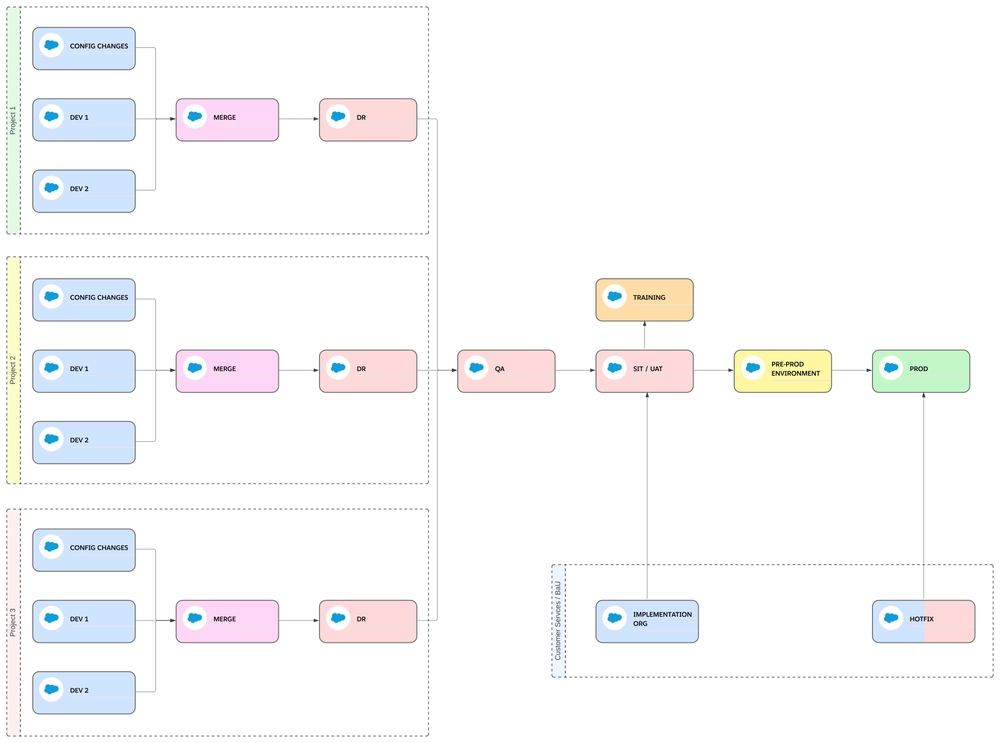

Starting with the [base git repository setup](../03-travis-ci.html#preparing-your-repository-with-this-travis-ci-configuration) and [base Travis-CI configuration](../03-travis-ci.html#base-configuration) we can set this kind of complex pipeline:

In this pipeline we have 2 streams of work for long lived projects that promote to production on different frequencies: Project 1 (P1) and Project 2 (P2). But we could plug in any number of projects we need.
Apart from them, we have another stream of work for Business as Usual user stories with a set weekly promotion agenda.

We want to be able to test both projects and in the same sandboxes for QA and SIT/UAT, but without bundling their changes together.
The business as usual changes will be tested in BAU's own testing environment: BAU TEST.

When changes from different streams of work are ready to be deployed, we can bundle them in the pipeline's BUNDLE stage, from where we can move the changes to the training environment and to production.

To start setting this pipeline we need to create the following branches, all of them from release (because eventually all of them will be merged to release in this example):
- **p1-release**: to bundle all the changes from project 1
- **p2-release**: to bundle all the changes from project 2
- **cs-enhancements**: to bundle all the changes from Business as Usual (a.k.a Client Services)
- **qa-environment**: as the source of truth of the metadata in the QA testing environment
- **uat-environment**: as the source of truth of the metadata in SIT/UAT testing environment

After setting up the git repository we need to create the following environment variables in Travis-CI settings:
- First the SFDX Auth URL for the implementation orgs, which we will use **for back-promotion**:
  - **CONFIG1_AUTH_URL**: this will allow us to back-promote changes to this org by creating a backpromote tag for them, in this case it will be `backpromote-config1-YYYYMMDD`, where YYYYMMDD is the current date.
  - **DEV1_AUTH_URL**: this will allow us to back-promote changes to this org by creating a backpromote tag for them, in this case it will be `backpromote-dev1-YYYYMMDD`, where YYYYMMDD is the current date.
  - **DEV2_AUTH_URL**: this will allow us to back-promote changes to this org by creating a backpromote tag for them, in this case it will be `backpromote-dev2-YYYYMMDD`, where YYYYMMDD is the current date.
  - **DEV3_AUTH_URL**: this will allow us to back-promote changes to this org by creating a backpromote tag for them, in this case it will be `backpromote-dev3-YYYYMMDD`, where YYYYMMDD is the current date.
  - **DEV4_AUTH_URL**: this will allow us to back-promote changes to this org by creating a backpromote tag for them, in this case it will be `backpromote-dev4-YYYYMMDD`, where YYYYMMDD is the current date.
  - **BAUDEV_AUTH_URL**: this will allow us to back-promote changes to this org by creating a backpromote tag for them, in this case it will be `backpromote-baudev-YYYYMMDD`, where YYYYMMDD is the current date.
- Then we'll create the environmen variables for the **unboundled** testing environments' SFDX Auth URLs:
  - **QA_AUTH_URL**: so when we create a pull request and merge to qa-environment branch Travis will first validate and then promote the changes against the org configured in this environment variable.
  - **UAT_AUTH_URL**: so when we create a pull request and merge to uat-environment branch, Travis-CI will first validate and promote the changes to the org configured here.
- We'll have to create the variables for the SFDX Auth URLs of the orgs where we merge/bundle the changes in each of the streams of work: Project1, Project2 and Business as Usual, so we can test the user stories for these different streams of work standalone:
  - **P1_AUTH_URL**: Travis-CI will use this org to validate and promote the changes we merge to `p1-release` (using a PR). In the example we will use `MERGE1` sandbox.
  - **P2_AUTH_URL**: Travis-CI will use this org to validate and promote the changes we merge to `p2-release` with a PR. In the example we will use `MERGE2` sandbox.
  - **CLIENT_SERVICES_TEST_AUTH_URL**: Travis-CI will use this org to validate (creating a PR) and promote (merging the PR) the changes we merge to `cs-enhancements` branch. For our example it is `BAU TEST`.
- And last, we need to configure the environment variable that holds the credentials for `BUNDLE` and `TRAINING`:
  - **TRAINING_AUTH_URL**: Travis-CI will use the credentials url stored here to promote changes here when we create a non-production version tag for training: i.e. `training-v1.2.0`.
  - **MERGE_AUTH_URL**: This is part of the basic Travis configuration, but here we need to make sure we set this environment variable with the SFDX Auth URL for BUNDLE. Because this variable is the one Travis-CI will use when we create a PR to `release` and then merge it to validate and promote changes there.

After creating these branches in the git repository and environment variables in Travis-CI, we are ready to start using the pipeline.

This is how we will bring the specific stream of work changes to the pipeline:
1. We will implement the changes in one of the implementation orgs, depending on what stream of work we're workin in.
2. When we have finished implementing the user story there, we will **create a feature branch** from the stream of work merge/bundle branch. For **Project 1** it will be `p1-release`, for **Project 2** it will be `p2-release`, and for **Business as Usual** it will be `cs-enhancements`.
3. We will retrieve our changes to that feature branch and then we will commit and push the branch, so it's in GitHub.
4. We will **create a pull request** from the feature branch to the branch from where we created it. This will trigger Travis-CI to validate the changes:
   - Running a **validation deployment** against the merge/bundle environment of that stream of work. I.e. if we've create the PR against p1-release, Travis-CI will look for the environment variable P1_AUTH_URL and use those credentials to validate.
   - Running **PMD** on the changes if there is code.
   - Running **Prettier** if there is code in the changes.
5. When checks pass and the **PR is approved we can merge it**. This will trigger Travis-CI to promote the changes to that merge/bundle environment. We can run tests to see if the functionality we've implemented works before merging it with other changes coming from other streams of work.
6. *(Not for Business as Usual)* When these tests pass and we can **move the changes to QA** environment, to do so:
   - **Create a PR** between the merge/bundle branch of the stream of work (`p1-release` or `p2-release` for us) **to qa-environment** branch. This will trigger Travis-CI to look for the environment variable `QA_AUTH_URL` and use those credentials and validate the changes there, to make sure it is deployable with any other user stories that may be tested there.
   - **Merge the PR**, which will trigger Travis-CI to promote the changes to that environment.
7. *(Not for the Business as Usual stream of work)* When these changes pass QA, it's time to move them to SIT/UAT, and we'll do it similarly as we did for QA:
   - **Create a PR** between the merge/bundle branch of the stream of work (`p1-release` or `p2-release` for us) **to uat-environment** branch. This will trigger Travis-CI to look for the environment variable `UAT_AUTH_URL` and use those credentials and validate the changes there, to make sure it is deployable with any other user stories that may be tested there.
   - **Merge the PR**, which will trigger Travis-CI to promote the changes to that environment.

When UAT passes and we're ready to promote to production we'll fist bundle the changes with all other changes ready for production. From the moment we bundle these changes we cannot unbundle them, so it's a promote all or nothing situation. To bundle the changes we will:
1. **Create a pull request** from the merge/bundle branch of the stream of work (p1-release, p2-release or cs-enhancements) **to `release` branch**. This will let us know about any final conflict between any of the projects and business as usual, and it will trigger Travis-CI to **validate the changes** against the environment we've configured in `MERGE_AUTH_URL` (for us it's BUNDLE), including running PMD and Prettier.
2. **Merge the pull request**. Which will trigger Travis-CI to promote these changes to that org on `MERGE_AUTH_URL`.

When it's time to **move the changes** we're going to promote **to TRAINING**, we will need to create a non-production version tag for training in `release` branch. This is a version tag that start with `training-`. I.e. `training-v1.2.0`. This will trigger Travis-CI to look for the variable TRAINING_AUTH_URL and promote the changes to the environment configured in it.

Next, it's time to deploy all the bundled changes, and we will do it exactly like we'd do it for the simple pipelines:
1. We'll create a pull request between `release` and `main`, and with that Travis-CI will validate agains production, which is configured in PROD_AUTH_URL Travis-CI environment variable.
2. If the validation passes and after the PR is reviewed, we can merge it. This won't trigger anything in Travis-CI.
3. When we are ready to move the changes to production we will create a production version tag in `main` branch: i.e. `v1.2.0`. This will trigger Travis-Ci to:
   - **Create a GitHub Release** with a zip file that includes only the changes we are promoting to production.
   - **Promote** the changes to production.

After we have promoted to production, we need to back-promote the changes through the pipeline so the orgs don't drift apart.

If we only have changes coming from the Business as Usual stream of work, we'll need to make sure the orgs on the projects stream of work receive the changes:
- For SIT/UAT we will create a backpromote tag in main, we'll call it `backpromote-uat-YYYYDDMM`, so Travis-CI knows it needs to be back-promoted to **UAT_AUTH_URL**.
- For QA we will create another backpromote tag in main named `backpromote-qa-YYYYDDMM` and Travis-CI will know to back-promote to **QA_AUTH_URL**.
- For the merge/bundle environments in each of the projects, we'll **merge `release` to** the stream of work's release branch: **p1-release and p2-release** for our example.
- For each one of the implementation environments we'll create a backpromote tag in `main`:
  - `backpromote-config1-YYYYMMDD` tag will back-promote the changes in the environment configured in **CONFIG1_AUTH_URL**.
  - `backpromote-dev1-YYYYMMDD` tag will back-promote the changes in the environment configured in **DEV1_AUTH_URL**.
  - `backpromote-dev2-YYYYMMDD` tag will back-promote the changes in the environment configured in **DEV2_AUTH_URL**.
  - `backpromote-dev3-YYYYMMDD` tag will back-promote the changes in the environment configured in **DEV3_AUTH_URL**.
  - `backpromote-dev4-YYYYMMDD` tag will back-promote the changes in the environment configured in **DEV4_AUTH_URL**.

If the changes only come from Business as the projects, we'd meed to back-promote the changes to the implementation environment of Business as Usual, but creating a back-promote tag in `main` like this: `backpromote-baudev-YYYYMMDD` and Travis-CI will back-promote the changes to the org configured in the environment variable **BAUDEV_AUTH_URL**.

For all those promotions, it's recommended to coordinate with the projects or business as usual teams to make sure it's possible to do that without them losing changes that may not be in a feature branch yet.
Also consider YYYYMMDD as the date of the back-promotion. But we can use anyother thing that makes the back-promotion label unique for that environment.

The last step will be to update the environment variable **PROD_VERSION** in Travis-CI settings to the one used in main to promote the changes to production.

**[<< Back to Pipeline Examples](../03-travis-ci.html#pipeline-examples-implementation)**