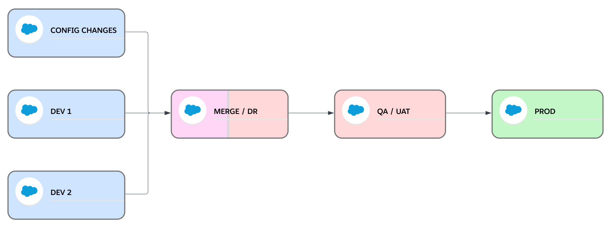

In this pipeline we have 3 sandbox in which our team is going to be implementing changes: CONFIG CHANGES, DEV 1 AND DEV 2, and the pipeline will bundle them together in an environment that will be used for merging and DR (dry run) tests. And from there it will move the changes to a testing environment for QA and UAT and after that, it will promote the changes to production.

With the [base configuration](../03-travis-ci.html#preparing-your-repository-with-this-travis-ci-configuration) we are almost totaly set up to be able to work with a simple project or business as usual pipeline like this:

We just need to add an auth url environment variable per each of our implementation environments and another one for the QA / UAT environments in Travis-CI settings, in our example we'll the following 4:
- **CONFIG_AUTH_URL** with the `SFDX Auth URL` for CONFIG CHANGES implementation environment.
- **DEV1_AUTH_URL** with the `SFDX Auth URL` for DEV 1 implementation environment.
- **DEV2_AUTH_URL** with the `SFDX Auth URL` for DEV 2 implementation environment.
- **UAT_AUTH_URL** with the `SFDX Auth URL` for QA / UAT testing environment.

This is how we can start using this simple project pipeline, very similar to the simple pipeline scenario:
1. When we have finished a user story we will create a `feature` branch from `release` branch.
2. We will retrieve the changes we've made in any of the implementation environments to that `feature` branch and push the changes, we can use VS Code Salesforce Extensions for retrieving the metadata, or the salesforce cli, or any other tool.
3. We will create a pull request from the `feature` branch to `release`, this will trigger Travis-CI to:
   - **Validate** the changes against the org we've configured in MERGE_AUTH_URL environment variable in Travis-CI Settings.
   - Run **static code validation** on the changes: PMD.
   - Run **prettier** to check the changes follow our style.
4. Once the PR is reviewed and all the validations pass, we'll `merge the PR` and this will trigger Travis-CI to promote the changes to the org in MERGE_AUTH_URL, where we can run other types of tests like SIT, UAT or end-to-end tests.
5. We will repeat these steps 1 to 4 for all the user stories we want to promote to production.
6. When we are ready to move the changes to our QA / UAT environment we will **create a non-production version tag** in `release` branch. Because we've configured the this environment as **UAT**_AUTH_URL, our non-production version tag should start with `uat-` followed with the next semver number, and we can optionally add anything else, if needed. I.e. `uat-v1.2.0` or `uat-v1.2.0-fix.1`. This will trigger Travis-CI to create a delta package with the changes in `release` and promote it to QA / UAT.
7. When we have validated the functionality, we'll create a pull request between `release` and `main`, and with that Travis-CI will validate agains production, which is configured in PROD_AUTH_URL Travis-CI environment variable.
8. If the validation passes and after the PR is reviewed, we can merge it. This won't trigger anything in Travis-CI.
9. When we are ready to move the changes to production we will create a production version tag in `main` branch: i.e. `v1.2.0`. This will trigger Travis-Ci to:
   - **Create a GitHub Release** with a zip file that includes only the changes we are promoting to production.
   - **Promote** the changes to production.
10. Last step is to make sure the pipeline is re-based and all sandboxes are up to date with the latest version in production:
   -  First we will back-promote the new version to all the implementation environments by creating `backpromote` tags in `main` for each one of the implementation environments. I.e. for CONFIG CHANGES, which is configured in Travis-CI as **CONFIG**_AUTH_URL, we will create a tag named `backpromote-config-yyyymmdd` where `yyyymmdd` is the current date. With this tag Travis will find out it needs to backpromote the new version to the org configured in CONFIG_AUTH_URL. Then we'll create backpromote tags for DEV 1 and DEV 2, like this: `backpromote-dev1-yyyymmdd` and `backpromote-dev2-yyyymmdd` 
   -  And last, we will `change the PROD_VERSION` environment variable in Travis-CI to the production tag we've used, i.e. `v1.2.0`. So for the next release Travis-CI will create the delta package by calculating the differences from that version.

When we create `backpromote` and `non-production version` tags Travis will extract the Id of the environment to which we will back-promote or promote, and will look for a `_AUTH_URL` environment variable that starts with that Id. I.e. for uat-v1.2.0, it will look for UAT_AUTH_URL.
If this environment variable doesn't exist, Travi-CI will fail the job.

With this we have bundled a set of changes from one or more of the implementation environments and promote them to our testing environments and finally to production.

**[<< Back to Pipeline Examples](../03-travis-ci.html#pipeline-examples-implementation)**